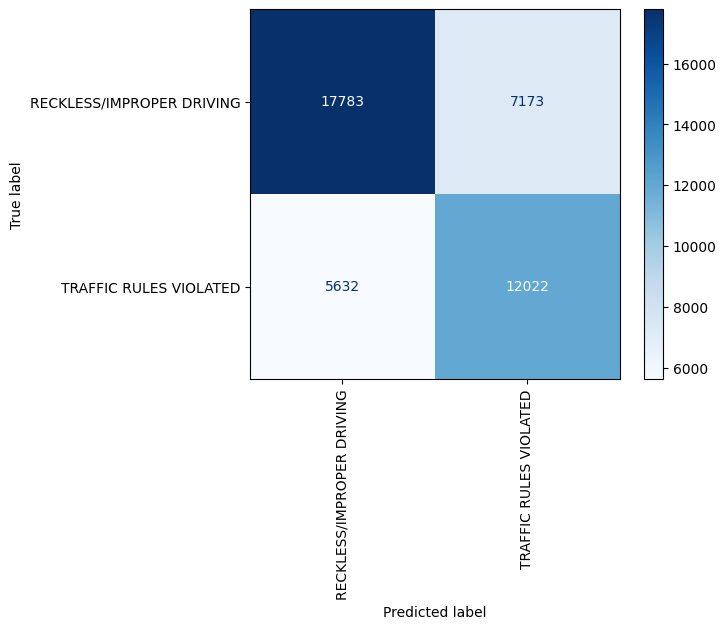
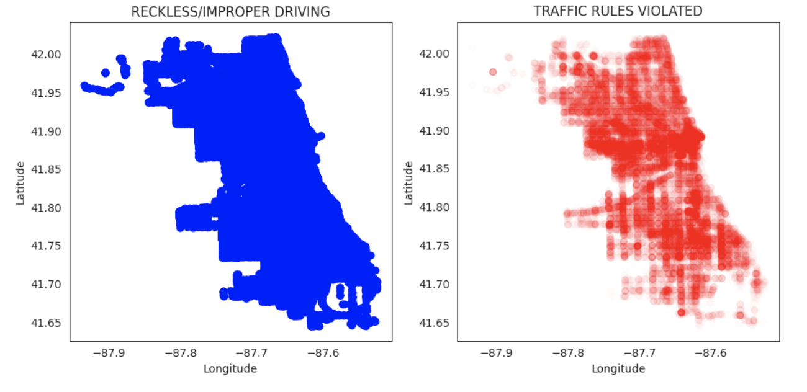
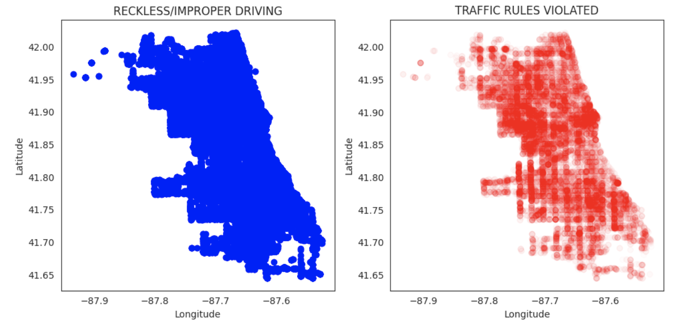
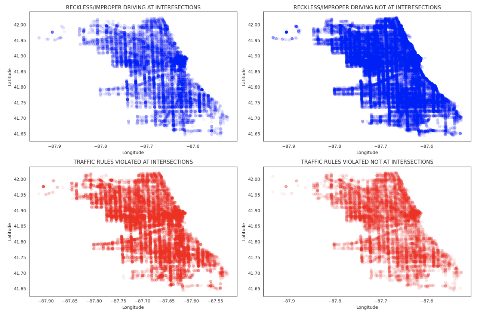
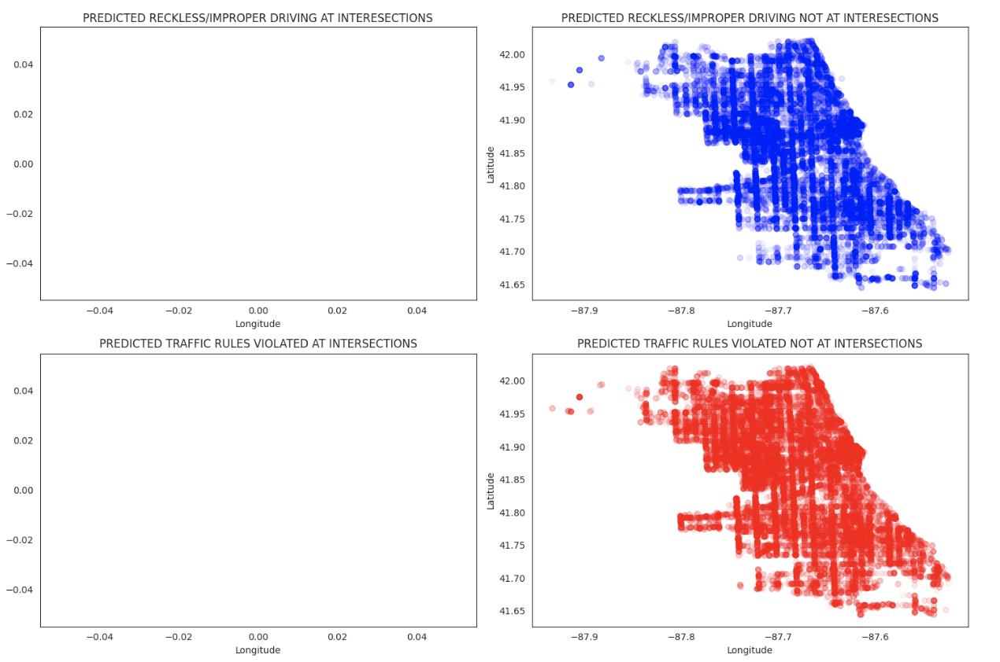
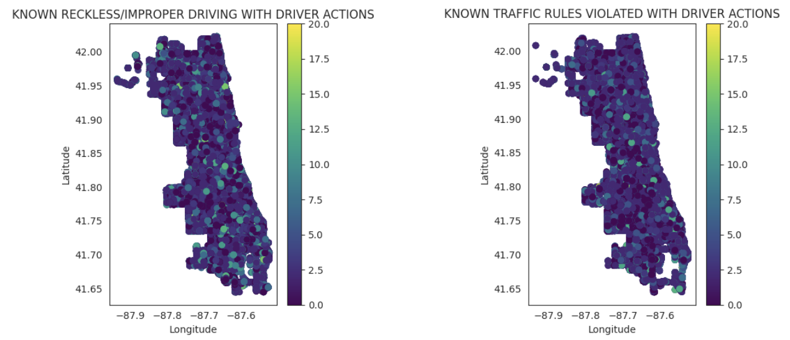

## Problem Overview
Each year more than 42,000 people are needlessly killed on American streets and thousands more are injured. We call this suffering traffic “accidents” — but, in reality, we have the power to prevent traffic collisions. To counter these fatalities and injuries, the Department of Transportations (DOTs) across the US are working towards a new vision for safety called "Vision Zero". 

Vision Zero recognizes that people will sometimes make mistakes, so the road system and related policies should be designed to ensure those inevitable mistakes do not result in severe injuries or fatalities. This means that system designers and policymakers are expected to improve the roadway environment, policies (such as speed management), and other related systems to lessen the severity of crashes by working with stakeholders ranging from auto manufacturers to policy makers.

Similarly, the Chicago DOT wants to conduct a study to improve their methodolodies of mitigating crashes. There are usually a lot of crashes that result in causes never being identified and also serveral car crashes can form an underlying pattern. Chicago DOT waants to understand what multitude of factors can play some of the biggest roles in causing these crashes.

That is why this notebook is going to explore developing a model for predicting primmary contributary causes to car crashes and identifyng the top 10 factors that we find the biggest roles in these causes. 
We will  use the data available to predict the primary contributory cause of a car accident, given information about the car, the people in the car, the road conditions etc.

## Data Sources
The data being used is from the Chicago Polic Department (CPD) and is provided oninee by the City of Chicago. The data is from 2015 to the present day. It is updated daily but the data being used as a part of this project is recent until 3rd February 2023. 

There are 3 datasets being used for analysis:

1. Traffic crashes data summary: https://data.cityofchicago.org/Transportation/Traffic-Crashes-Crashes/85ca-t3ifhttps://data.cityofchicago.org/Transportation/Traffic-Crashes-Crashes/85ca-t3ifv 
 

2. Vehicles information involved in a crash: https://data.cityofchicago.org/Transportation/Traffic-Crashes-Vehicles/68nd-jvt3 
 

3. People information involved in a crash: https://data.cityofchicago.org/Transportation/Traffic-Crashes-People/u6pd-qa9d 
Considering that this is the official dataset of the City of Chicago regarding traffic crashes, it can be easilly concluded that it would be the most reliable dataset available. Using this dataset will also increase the confidence of the client on the results and recommendations of this project. 

### Traffic Crashes - Crashes
This is the summary data for all the crashes. Thee dataset was downloaded and stores in the `data` folder as `Traffic_Crashes-Crashes`. The overview of the contents of this data is aavailable below and at https://data.cityofchicago.org/Transportation/Traffic-Crashes-Crashes/85ca-t3if.

Crash data shows information about each traffic crash on city streets within the City of Chicago limits and under the jurisdiction of Chicago Police Department (CPD). A traffic crash within the city limits for which CPD is not the responding police agency, typically crashes on interstate highways, freeway ramps, and on local roads along the City boundary, are excluded from this dataset.

As per Illinois statute, only crashes with a property damage value of $1,500 or more or involving bodily injury to any person(s) and that happen on a public roadway and that involve at least one moving vehicle, except bike dooring, are considered reportable crashes. However, CPD records every reported traffic crash event, regardless of the statute of limitations, and hence any formal Chicago crash dataset released by Illinois Department of Transportation may not include all the crashes listed here.

There are in total 49 features in this dataset. Through domain knowledge and data understanding, 19 features were seeleccted to be taken forward. The columns with categorical data being ccarried forward were encoded using either spiral encoding or one hot encoding. 

The columns to be carried forward are:
1. CRASH_RECORD_ID
2. CRASH_DATE
3. POSTED_SPEED_LIMIT
4. DEVICE_CONDITION
5. WEATHER_CONDITION
6. CRASH_TYPE
7. PRIM_CONTRIBUTORY_CAUSE
8. SEC_CONTRIBUTORY_CAUSE
9. WORK_ZONE_I
10. WORKERS_PRESENT_I
11. INJURIES_TOTAL
12. INJURIES_FATAL
13. CRASH_HOUR
14. CRASH_DAY_OF_WEEK
15. CRASH_MONTH
16. LATITUDE
17. LONGITUDE
18. LIGHTING_CONDITION
19. NUM_UNITS

### Traffic Crashes - Vehicles
This is the summary data for all the crashes. Thee dataset was downloaded and stores in the `data` folder as `Traffic_Crashes-Vehicles`. The overview of the contents of this data is aavailable below and at https://data.cityofchicago.org/Transportation/Traffic-Crashes-Vehicles/68nd-jvt3.

This dataset contains information about vehicles (or units as they are identified in crash reports) involved in a traffic crash. This dataset should be used in conjunction with the traffic Crash and People dataset available in the portal. “Vehicle” information includes motor vehicle and non-motor vehicle modes of transportation, such as bicycles and pedestrians. Each vehicle, each pedestrian, each motorcyclist, and each bicyclist is considered an independent unit that can have a trajectory separate from the other units. Vehicle information can be linked back to Crash data using the “CRASH_RECORD_ID” field. Since this dataset is a combination of vehicles, pedestrians, and pedal cyclists not all columns are applicable to each record.

There are in total 72 features in this dataset. Through domain knowledge and data understanding, 8 features were seeleccted to be taken forward. The columns with categorical data being ccarried forward were encoded using either spiral encoding or one hot encoding.

The columns to be carried forward are:
    1. CRASH_RECORD_ID
    2. VEHICLE_DEFECT
    3. VEHICLE_TYPE
    4. VEHICLE_USE
    5. MANEUVER
    6. OCCUPANT_CNT
    7. FIRST_CONTACT_POINT
    8. VEHICLE_CONFIG

### Traffic Crashes - People
This data contains information about people involved in a crash and if any injuries were sustained. A pedestrian is a “unit” by itself and have a one to one relationship between the Vehicle and Person table.

There are in total 30 features in this dataset. Through domain knowledge and data understanding, 11 features were seeleccted to be taken forward. The columns with categorical data being ccarried forward were encoded using either spiral encoding or one hot encoding.

There are several Data limitations that we have to keep in mind with regards to these dataset.

    1. Only using CPD data, there might be data missing that is not reported to the CPD
    2. Interstate highways, freeway ramps, and on local roads along the City boundary, are excluded from this dataset
    3. Around half of the data is self reported and may have bias in them, missing or incorrect information
    4. There's no data on the traffic volume, congestion level, or the speed the vehiclees were moving at
    5. There are large imbalancces in the dataset and some columns have a lot of missing values. Later on during cleaning and processing, there has to be an assumption that the report created was accurate and there were no glaring detailss overlooked like Intersections, Work Zones, etc.
    6. The data has to be binned together to reduce the granularity of the dataset which can impact the data
    7. The large imbalances would require either getting rid of a large number of records or creating a lot of ssynthetic data for oversampling
    8. A lot of the primary and ssecondary causes are overlapping information. There is no set standard that clearly biifurcates the different categories of car crashes which can cause the precision of reults st go down.

Data was cleaned and multiple categories were binned together to reduce the graanularaity of the dataa. The target vaariable was binned together into 2 main categories: 1.Reckless/Improper Driving, 2.Violating Traffic Rules. Lastly, they were encoded to convert into numericaal data for efficient modelling.

---------------------------------------------------------------------------------------------------------------------------------

After Data Cleaning, the three datasets were combined on the Crash Record ID and then they were prepared for modelled.

The information for Primary Contributary Causes that were labelledas unable to determine were separated to predict with our final model. 

The data was split into train and test sets using Group Shuffle Split to keep the records from the same crash under either the triain set or the test set.

The data was then scaled using the Standard Scaler to remove significant bias from any single feature. 

The data was undersampled based on the target variable using the Random Undersampler to 100000 records for both categories. This was done in order to optimize computing time.

After resampling, the top 10 features were selected using the Mutual Information method to understaand which features give us the mosst information about the target variable to use in our modelling.

---------------------------------------------------------------------------------------------------------------------------------

After filtering out the features, a baseline model using Decision Trees was set up. this was followed by the KNN model, Raandom Forests and XG Boost. In the process of modelling, the models hyperparameters were tuned in order to find the optimized model to use.

The modelling results were as follows:

1. Decision Trees (Baseline Model):
    Accuracy: 0.70
    Precision: 0.70
    

2. KNN:
    Accuracy: 0.73
    Precision: 0.74
    

3. Random Forest:
    Accuracy: 0.74
    Precision: 0.74
    

4. XG Boost:
    Accuracy: 0.76
    Precision: 0.76
    

## Results:
Final Model: Random Forest

The highest number of records for primary contributaaaary cause was Unable to Determine with almost 260,000 records out of a totaal of 690,000 which is a ~38% of the records. Being able to predict the causes of these crashes with 76% will be able to help the CDOT to significantly improve work towards Vision Zero and reduce the uncertainty in one of their singular biggest car crash cause.

Looking at the Top 4 features contributing to these crashes, the comparitive resultss are as follows:

Latitude and Longitude:

    

We can clearly see a demarcation in the hotspots for Traffic Rules being violated. Whikle REckless/Improper driving is spread fairly equally all over Chicago, Traffic Rules Violation has concentrated hotspots in certain densely populated areas, for instance, the downtown chicago area. Lets see how did the unablee to determine dataset is spread out.

    

We see a similar trend where traffic rule violations have hoot spots in densely populated areas. This is something that CDOT can explore further to deriive insights for poliicy and action.

Intersection Related:

We can cleaarly see that for reckless/improper driving, it happens alot more when drivers are not at intersectionss but for traaffci rules are violated more at intersections. This can help inform DOT how to takee appropriate measures. Next we will check whether the predicited dataset for unable to determine has a simlar trend.

Looks like wee didn't have any intersecton related events for the unable to determine dataset.
For the Non-intersection related events we can see a similat trend of higher traffic violations and more reckless improper driving in densely populated/touristy areas.

Driver Action:

There is no explicit dsicernable pattern fro driver action but the fact that it is the third highest contributing factoor too predicting crashes means that it should be explored further

Also, looking at the features that showcased to play the largest imapct were the ones listed below. CDOT understands that their are always multiple factorss at play fora cause and it iss difficult to boil down and identify a singular cause. While there might be a singular cause that is very apparent, there can be certain trens, underlying patterns or other causes that can help the stakeholders derive insights into how to tackle certain causes of crashes and mitigate injuries/fatalities. This will grealy help CDOT mode further in its goal towards Vision Zero

1. Latitude: 0.32
2. Longitude: 0.32
3. Driver Action: 0.11
4. Intersection Related Indicator: 0.09
5. First Contact Point: 0.05
6. Device Condition: 0.04
7. Maneuver: 0.04
8. Number of Units: 0.03
9. Occupant Category: 0.01
10. Weather Condition: 0.01

## Improvements:
       1. The model can be improved with higher granular datasets but will require higher computng resources. This will allow the models to haave better predictions aand provide more detailed insights.
   

    2. Random Sampling can be performed using centroidal methods. This will allow for a more uniform of distribution. Currently, the RAndom Sampling methods don't taake into account that there are multiple records for the same crash ID. Using Centroidal methods will allow for improved accuracy with sampling so that all records for the same crash have representation in the training sets.
   

    3. Use pipelines for faster performance. This will bring down the computng speeds because a lot of similar processes can be performed a the same time.
   

    4. A few parameter searches reached maximum, try it more iterations with higher values. We saw that some of the grid searched we did outputted the best parameters as the maximum value of the range of that paaraameter fed into the search. It would be beneficial to do several more multiple iterations to improve the overall parameter grid.
   

    5. Reduce the amount of bins used. Keep binning to the target variable only. This will allow for the predictor variables to be more discernable. This can allow the model to improve predictions when higher granular data is used for the Target Variable

   

    6. Use all the features rather than using only the op 10 features. This might help improve accuracy by providing more information for the models to disern the categories.

   

    7.  Use all the records rather than undersampling to provide more information for the models.

   

    8. Train with more data for the Taaraget Variable categories that had low number of records in the original Chicago DOT dataset

   

    9. Rather than dropping features in the Data Understanding section, use all features to determine which ones provide the most information and then select the top 10 features. It is possible that there aare highly informational columns that were dropped.

## RECOMMENDATIONS:
It would be helpful to further refine the models to increase the accuracy to be greater thaan 90% to create a model that has a very high level of confidence.

Alongside, CDOT can start investigating the top 10 factors based on their scoring from the feature selection section.

Revisiting the results from the feature selection scores for the Top 10 factors:

1. Latitude: 0.32
2. Longitude: 0.32
3. Driver Action: 0.11
4. Intersection Related Indicator: 0.09
5. First Contact Point: 0.05
6. Device Condition: 0.04
7. Maneuver: 0.04
8. Number of Units: 0.03
9. Occupant Category: 0.01
10. Weather Condition: 0.01

With Latitude and Longitude being the biggest contributors, it is clear that there is a trend in certain locations of the type of aciidents taking place. This can be explored to identify if there aare certain areas that have deisgns or mobility patternss that make it more prone to accidents/crashes and appropriate measures can be taken to mitigate these.

The next is driver action which can showcase if there are certain certain drivver actions are causing an increase of crashes. This is one of the columns where the original granularity of the dataset was maintained. This shows that higher graanularity can be useful for the models. Alongside this, Driver Actions can be analyzed based on correlation with the Causes to understand what kind of actions are causing higher amount of crashes and appropriate measures can be taken to inform drivers about the dangers of certain actions or use traffic engineering principles to make it difficult to take certain actions.

Intersection related is interesting because Intersections have one of the most diverse mobility traffic with mutiple movements taking place at the same time. This feature can be explored further to understand which crashes are highly correlated with the presence of intersections and take appropriatae steps to mitigaate those risks.

Similarly, the remaining factors can be explored to further analyze the kind of correlations that these feature have to causes and create policy and mitigation measures to move CDOT closer to Vision Zero.

---------------------------------------------------------------------------------------------------------------------------------
## MORE INFORMATION:
Please use the following links to get more information:
1. Click [here](https://github.com/shayanabdulkarimkhan/chicago-car-crashes-analysis/blob/main/notebook.ipynb) to see the full analysis: 
2. Click [here](https://github.com/shayanabdulkarimkhan/chicago-car-crashes-analysis/blob/main/Stakeholder%20Presentation.pptx) to see the overview presentation.

Please feel free to contact me at shayan.khan@nyu.edu if you would like to understand more talk about the project.

---------------------------------------------------------------------------------------------------------------------------------
├── cm_images
├── Notebook Iterations
├── pdf
├── notebook.ipynb
├── Stakeholder Presentation.pptx
└── README.md
